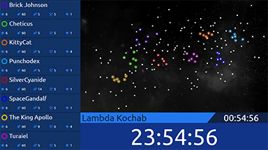
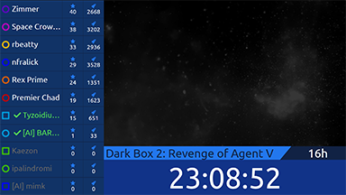

# Neptune's Pride 2 Wallboard #
## Version 1.0.1 ##
A ten-foot style display for tracking stats in Neptune's Pride 2: Triton. A live
demo is available [on my website](http://www.brandonjd.net/np2/).

This project is licensed under the MIT License - see the LICENSE file for
details.

### Features ###
* List of the user's active and completed games for quick access.
* Prominent game timers for turn due time, production, and ticks.
* A full map of the visible galaxy.
* Player leaderboard with strength and research stats, and indicators for
  defeated/conceded players and turn completion.
* Support for normal, turn-based, and dark games.
* Server-side caching of authentication token and game data.

### Screenshots ###
Left: a standard game, right: a dark, turn-based game.

 

### Limitations ###
* The display requires game credentials to be set in order to load game data on
  behalf of the user.
* Only public games, or private games that the user has joined, can be
  displayed.
* If multiple users reload the display simultaneously after the cache expires,
  the game will throttle logins and the data may fail to load. This will also
	prevent login to the game for a few seconds. This is a limitation of
	Neptune's Pride 2, and is somewhat mitigated by login caching.

### Usage ###
1. Install dependencies with Composer.
2. Create a `data` directory and set its permissions such that your web server
   can write to it.
3. Rename `config.sample.ini` to `config.ini` and put your NP2 credentials into
   it.
4. Navigate your browser to the directory in which you installed the display.

Sample configuration:
```
username="your_email_or_true_alias"
password="your_password"
```

### Requirements ###
* [Composer](https://getcomposer.org/) (to load necessary dependencies)
* A web server running PHP 5.4 or higher.

### Development Requirements ###
Composer, [Compass](http://compass-style.org/), and a JavaScript uglifier of
your choice.

### Attributions ###
This project utilizes icon fonts found on [Fontello](http://fontello.com).
License info available in LICENSE file. Thanks!
